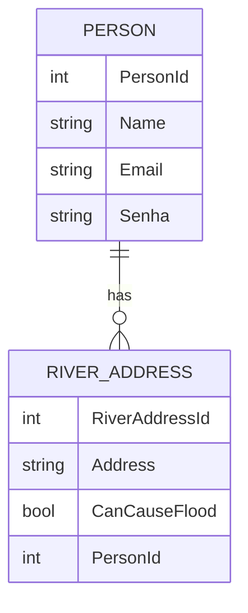

.# Youtube
https://youtu.be/q2SAQCvYXUY

# 🌊 Follow Rivers

Projeto backend desenvolvido em .NET com ASP.NET Core e Entity Framework. O objetivo é permitir o cadastro de pessoas e o registro de endereços de rios relacionados a elas, com a possibilidade de marcar se uma localização pode causar alagamentos.

---

## 📌 Sumário

- [Tecnologias Utilizadas](#-tecnologias-utilizadas)
- [Diagrama de Entidades](#-diagrama-de-entidades)
- [Como Rodar o Projeto](#-como-rodar-o-projeto)
- [Endpoints da API](#-endpoints-da-api)
- [Desenvolvimento](#-desenvolvimento)
- [Testes](#-testes)
- [Possíveis Melhorias Futuras](#-possíveis-melhorias-futuras)

---

## 🛠️ Tecnologias Utilizadas

- ASP.NET Core
- Entity Framework Core
- C#
- SQL Server
- RESTful API

---

## 📊 Diagrama de Entidades



---

## 💻 Como Rodar o Projeto

```bash
# 1. Clone o repositório
git clone https://github.com/seu-usuario/follow-rivers.git
cd follow-rivers

# 2. Restaure os pacotes
dotnet restore

# 3. (Opcional) Aplique as migrations (caso esteja usando migrations do EF Core)
dotnet ef database update

# 4. Execute o projeto
dotnet run
```

A API ficará disponível em: `https://localhost:5001/api`

---

## 📡 Endpoints da API

### 👤 PersonController `/api/person`

| Método | Rota                  | Ação                                    |
|--------|-----------------------|-----------------------------------------|
| GET    | `/api/person`         | Lista todas as pessoas cadastradas      |
| POST   | `/api/person`         | Cria uma nova pessoa                    |
| POST   | `/api/person/login`   | Realiza login com email e senha         |
| PUT    | `/api/person/{id}`    | Atualiza os dados de uma pessoa         |
| DELETE | `/api/person/{id}`    | Remove uma pessoa do sistema            |

**Exemplo de payload:**

```json
{
  "name": "João da Silva",
  "email": "joao@email.com",
  "senha": "123456"
}
```

---

### 🌍 RiverAddressController `/api/riveraddress`

| Método | Rota                         | Ação                                              |
|--------|------------------------------|---------------------------------------------------|
| GET    | `/api/riveraddress`          | Lista todos os endereços de rios cadastrados      |
| POST   | `/api/riveraddress`          | Cria um novo endereço de rio para uma pessoa      |
| PUT    | `/api/riveraddress/{id}`     | Atualiza um endereço de rio                       |
| DELETE | `/api/riveraddress/{id}`     | Remove um endereço de rio                         |

**Exemplo de payload:**

```json
{
  "address": "Rua do Rio 123",
  "canCauseFlood": true,
  "personId": 1
}
```

---

## ⚙️ Desenvolvimento

O projeto possui os seguintes componentes:

- **Controllers**: `PersonController` e `RiverAddressController` lidam com as requisições REST.
- **DTOs**: Utilizados para entrada de dados (`PersonDTO`, `RiverAddressDTO`).
- **Models**: Representam as entidades persistidas no banco de dados.
- **DbContext (`FollowRiversContext`)**: Responsável pelas operações de persistência e leitura no banco.

---

## 🧪 Testes

Atualmente os testes manuais são realizados utilizando ferramentas como [Postman](https://www.postman.com/) ou [Insomnia](https://insomnia.rest/) para validar os seguintes fluxos:

1. **Criação de usuário** com validação de e-mail duplicado e campos obrigatórios.
2. **Login** com verificação de credenciais válidas e inválidas.
3. **Criação de endereço de rio** vinculado a uma pessoa válida.
4. **Listagem e remoção** de pessoas e endereços.

> 💡 Sugestão futura: implementar testes automatizados com xUnit ou MSTest e cobertura de código com Coverlet.

---

## ✅ Possíveis Melhorias Futuras

- Autenticação com JWT e roles de usuário.
- Logs com Serilog ou NLog.
- Testes automatizados.
- Paginação nos endpoints GET.
- Documentação com Swagger.

---
